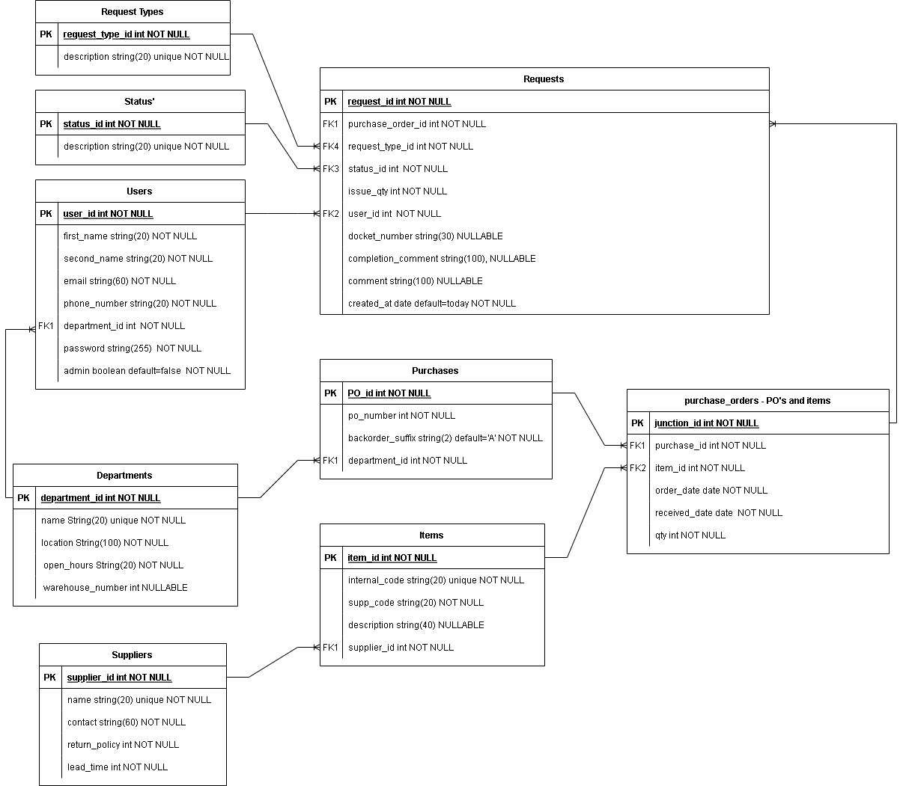
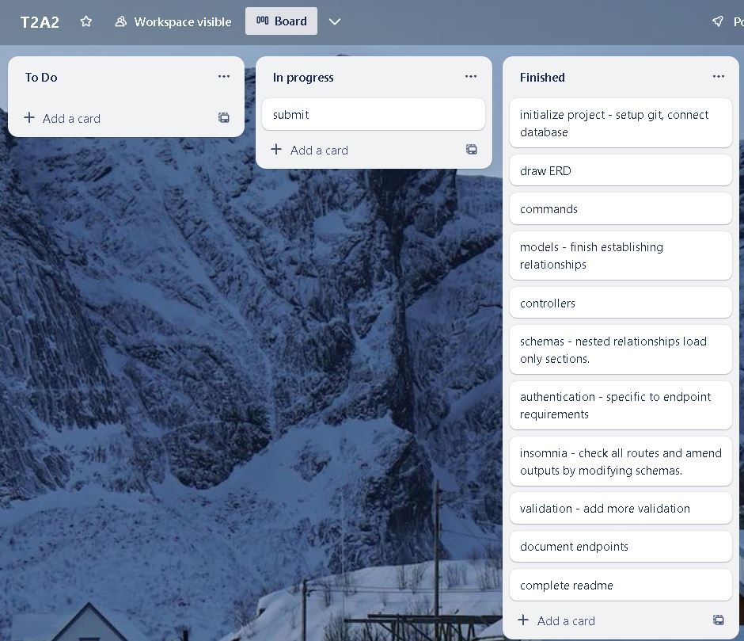

## Supplier Request Form API

#### R1 Identification of the problem you are trying to solve by building this particular app.

This application aims to solve the problem of organising and streamlining access to team requests on a broad scale.  In the real world, warehouse teams receiving goods are constantly experiencing errors with what is shipped, whether that be incorrect supply of goods, no goods at all or many other scenarios. From a sales perspective an ETA helps to keep customer relations positive. Modifying code or contacting the supplier is a restricted function within the business model for this company. Most dealings with the supplier are funnelled through the purchasing team as well as the job of maintaining data integrity/accuracy for all the orders and this application will streamline the visibility of actions for those that need to know them. 

#### R2 Why is it a problem that needs solving?

Although you could use pure email communication or over the phone contact this also presents several issues once volumes increase. This makes it difficult to determine urgency, what is easy to resolve vs hard etc. It also helps to regulate what information teams are giving to the purchasing side of the operation. This API is designed to organise these requests for the purchasing team to be able to review in mass in a timely manner, effectively cutting costs or providing excess time for more important tasks. It could also help distribute easier tasks to newer/less skilled team members to reduce the work- load for those with a higher skill ceiling.

#### R3 Why have you chosen this database system. What are the drawbacks compared to others?

I've chosen to use the postgreSQL database system as it provides several quality features that I needed for this build. It's known to have strong data integrity and reliability making it suitable in keeping the input from multiple users clean and organised. It's scalable, as the company grows this will become an important factor in handling all the data and requests. It's open-source and free for use, given the situation as a student this works well. The security options and support are also effective keeping the actions and data visibility within the company itself and restricted to those that need to know.

Some of the drawbacks of this database are the issues with storage space, resource intensiveness. We may face compatibility issues if we choose to migrate as with PostgreSQL some of the dialect used differs from standard SQL. A large issue that seems problematic is that PostgreSQL is better for transactional applications and less suitable for business intelligence. This may pose a problem if I want to analyse the error rates of transactions against company data or otherwise.

#### R4 Identify and discuss the key functionalities and benefits of an ORM

Object-relational mapping is used to bridge the gap between direct database management and object-orientated programming through languages like python or java. The process of abstraction applied to the database operations means that writing raw SQL queries can be kept to a minimum if they are needed at all. This lets the user focus on building data structures using object and classes. This also makes it easier to model the information in the data for later amendments. ORM libraries provide easy to use methods for performing CRUD operations on records. ORM frameworks can also provide their own query languages that are more abstract than raw SQL making it easier to express complex queries. There is also the benefit of caching mechanisms to prevent the need to constantly fetch the data from the database. Overall, the benefits of an ORM provide increased productivity, portability, code maintainability, security and options for rapid proto-typing. 

#### R5 Document all endpoints for your API

note: if the field indicates both jwt and admin required then the bearer token must correspond with a user who has admin access. The logins provided in the login section have both types.

### Authorization endpoints - auth

There are a total of 2 endpoints of authorization both POST methods. To access these endpoints, The URL followed by the blueprint directory ```/auth``` then the route below will suffice.

```/register``` - takes new user data in Json format and returns a token. will not grant admin access and the password is encrypted upon entry. it will load specified parameters not all the Json. The below is the basic layout of the required Json.

```
{
    "first_name" : "Jam",
    "second_name": "Pipers",
    "email": "james@email.com",
    "password": "password",
    "phone_number": "0466664646",
    "department_id": 1 
}
```
```/login``` - takes the user data in Json format and returns a token for the session. The below are 2 users loaded in the seed data. one with admin credentials the other without. 

```
#admin access
{
    "email": "buyer@email.com", 
    "password": "password"
}
#non-admin
{
    "email": "seller@email.com", 
    "password": "password2"
}

```

Due to most endpoints having the same functions the data has been organised in a file called crud.py and called into each of the controller routes appending modifications for the unique routes. There are also unique requirements based on admin access.

corresponding base routes and operations as follows.

* route "/" method GET - this returns all the records of the table that corresponding with the route. It will return the data in a Json format.
* route "/<int:id>" method GET - this returns the record from the table of the corresponding model by id. the id needs to be put into the route to get this result
* route "/<int:id>" method DELETE - this will delete a record based of the id input from the given table of the corresponding model. out put for a successful deletion as below:
```
{
    "message": "Id '3' in items was not found. No records deleted"
}
```
* route "/" method POST - this will add a new record to the given table based assuming that the Json provided is accurate. specific inputs with corresponding route below.
* route "/<int:id>" method PATCH - this will adjust a current record as determined by the route and given id number. adjustments made will appear in Json format with the field specified altered. examples for the routes given below.
* route "/multiple" method POST - this will allow multiple records in Json format to be injected into a table. organise the Json records in a list. example data for the routes given below.

Remaining endpoints are as follows and the functionality the same following the crud options;

### Blueprint ```/departments```
* route "/" method GET - jwt required
* route "/<int:department_id>" method GET - jwt required
* route "/<int:department_id>" method DELETE -jwt required and admin status
* route "/" method POST - jwt required and admin status
```
{
    "name": "awesome",
    "location": "georgia",
    "open_hours": "4-6pm",
    "warehouse_number": 5
}
```
expected outcome
```
{
    "name": "awesome",
    "location": "georgia",
    "open_hours": "4-6pm",
    "warehouse_number": 5
}
```
* route "/<int:department_id>" method PATCH - jwt required and admin status
```
{
    "name": "fredzy",
    "warehouse_number": 5
}
```
expected outcome
```
{
    "name": "fredzy",
    "location": "george st, montgumry",
    "open_hours": "3-5pm",
    "warehouse_number": 5
}

```
### Blueprint ```/items```
* route "/" method GET - jwt required
* route "/<int:item_id>" method GET - jwt required
* route "/<int:item_id>" method DELETE - jwt required and admin status
* route "/" method POST - jwt required and admin status
```
{
    "internal_code": "j14",
    "supp_code" : "j14",
    "description": "words on a page",
    "supp_id" : 1
}
```
expected outcome 
```
{
    "internal_code": "j14",
    "supp_code": "j14",
    "description": "words on a page",
    "supplier": {
        "name": "Kmart",
        "lead_time": 7,
        "contact_email": "kmart@email.com",
        "claim_policy": 14
    }
}
```
* route "/multiple" method POST - jwt required and admin status
```
[
    {
        "internal_code": "j67",
        "supp_code" : "j14",
        "description": "words on a page",
        "supp_id" : 1
    },
    {
        "internal_code": "j1222224",
        "supp_code" : "j14",
        "description": "words on a page2",
        "supp_id" : 1
    },
    {
        "internal_code": "j14",
        "supp_code" : "j14",
        "description": "words on a page3",
        "supp_id" : 1
    }
]
```
expected outcome
```
[
    {
        "internal_code": "j67",
        "supp_code": "j14",
        "description": "words on a page",
        "supplier": {
            "lead_time": 7,
            "contact_email": "kmart@email.com",
            "name": "Kmart",
            "claim_policy": 14
        }
    },
    {
        "internal_code": "j1222224",
        "supp_code": "j14",
        "description": "words on a page2",
        "supplier": {
            "lead_time": 7,
            "contact_email": "kmart@email.com",
            "name": "Kmart",
            "claim_policy": 14
        }
    },
    {
        "internal_code": "j14",
        "supp_code": "j14",
        "description": "words on a page3",
        "supplier": {
            "lead_time": 7,
            "contact_email": "kmart@email.com",
            "name": "Kmart",
            "claim_policy": 14
        }
    }
]
```
* route "/<int:item_id>" method PATCH - jwt required and admin status, using the id 2 and the below:
```
{
    "internal_code" :"j4ffff3",
    "supp_code": "j43",
    "description": "john",
    "supp_id": 1
}
```
expected outcome
```
{
    "internal_code": "j4ffff3",
    "supp_code": "j43",
    "description": "john",
    "supplier": {
        "lead_time": 7,
        "contact_email": "kmart@email.com",
        "name": "Kmart",
        "claim_policy": 14
    }
}

```

### Blueprint ```/purchase_orders```
* route "/" method GET - jwt required
* route "/<int:purchase_order_id>" method GET - jwt required
* route "/<int:purchase_order_id>" method DELETE - jwt required and admin status
* route "/" method POST - jwt required and admin status
```
{
    "purchase_id": 1,
    "item_id": 4,
    "order_date": "2023-09-21",
    "qty": 15
}

```
expected outcome
```
{
    "purchase": {
        "po_number": 443,
        "backorder_suffix": "A"
    },
    "item": {
        "internal_code": "B5973",
        "supp_code": "SH5KS",
        "description": "Reading glasses"
    },
    "order_date": "2023-09-21",
    "received_date": null,
    "qty": 15
}
```
* route "/multiple" method POST - jwt required and admin status, multiple entries of the set out in a list can be logged using this route
* route "/<int:purchase_order_id>" method PATCH - jwt required and admin status using id 1 as the route
```
{
    "order_date": "2023-09-22",
    "qty": 20
}
```
expected outcome
```
{
    "purchase": {
        "po_number": 443,
        "backorder_suffix": "A"
    },
    "item": {
        "internal_code": "A5643",
        "supp_code": "read-46",
        "description": "book of love"
    },
    "order_date": "2023-09-22",
    "received_date": "2023-09-28",
    "qty": 20
}
```

### Blueprint ```/purchases```
* route "/" method GET - jwt required
* route "/<int:purchase_id>" method GET - jwt required
* route "/<int:purchase_id>" method DELETE - jwt required and admin status
* route "/" method POST - jwt required and admin status
```
{
        "po_number" : 443333333,
        "department_id": 3
}
```
expected outcome 
```
{
    "po_number": 443333333,
    "backorder_suffix": "A",
    "department_id": 3
}
```
* route "/multiple" method POST - jwt required and admin status
* route "/<int:purchase_id>" method PATCH - jwt required and admin status, using id 1 as the route
```
{
        "po_number" : 443333333,
        "department_id": 1
}
```
expected outcome
```
{
    "po_number": 30000,
    "backorder_suffix": "A",
    "department_id": 1
}
```

### Blueprint ```/request_types```
* route "/" method GET - jwt required
* route "/<int:request_type_id>" method GET - jwt required
* route "/<int:request_type_id>" method DELETE - jwt required and admin status
* route "/" method POST - jwt required and admin status
```
{
 "description": "PO tracking"
}
```
expected outcome
```
{
    "description": "PO tracking"
}
```
* route "/<int:request_type_id>" method PATCH - jwt required and admin status
```
{
 "description": "jogging"
}
```
expected outcome
```
{
 "description": "jogging"
}
```
### Blueprint ```/requests```
* route "/" method GET - jwt required
* route "/<int:request_id>" method GET - jwt required
* route "/<int:request_id>" method DELETE - jwt required and admin status
* route "/" method POST - jwt required
```
{ 
    "purchase_order_id": 1,
    "request_type_id": 1,
    "status_id": 1, 
    "user_id": 1,
    "comment": "the fish got out of the book",
    "issue_qty" : 2, 
    "docket_number": "g56"
}
```
expected outcome
```
{
    "purchase_order": {
        "purchase": {
            "po_number": 30000,
            "backorder_suffix": "A"
        },
        "item": {
            "internal_code": "A5643",
            "supp_code": "read-46",
            "description": "book of love"
        },
        "order_date": "2023-09-22",
        "received_date": "2023-09-28",
        "qty": 20
    },
    "comment": "the fish got out of the book",
    "issue_qty": 2,
    "docket_number": "g56",
    "created_at": "2023-10-01T21:39:14.835825",
    "request_type": {
        "description": "incorrect supply"
    },
    "status": {
        "description": "new"
    },
    "user": {
        "first_name": "buyer",
        "second_name": "Colbert",
        "email": "buyer@email.com",
        "phone_number": "0433345921",
        "department": {
            "name": "fredzy",
            "location": "george st, montgumry",
            "open_hours": "3-5pm",
            "warehouse_number": 5
        }
    },
    "completion_comment": null
}
```
* route "/<int:request_id>" method PATCH - jwt required

### Blueprint ```/statuses```
* route "/" method GET - jwt required
* route "/<int:status_id>" method GET - jwt required
* route "/<int:status_id>" method DELETE - jwt required and admin status
* route "/" method POST - jwt required and admin status
```
{
 "description": "PO tracking"
}
```
expected outcome
```
{
    "description": "PO tracking"
}
```
* route "/<int:status_id>" method PATCH - jwt required and admin status
```
{
 "description": "jogging"
}
```
expected outcome
```
{
 "description": "jogging"
}
```

### Blueprint ```/suppliers```
* route "/" method GET - jwt required
* route "/<int:supplier_id>" method GET - jwt required
* route "/<int:supplier_id>" method DELETE - jwt required and admin status
* route "/" method POST - jwt required and admin status
```
{
    "name": "wishful thinking",
    "contact_email": "wishful@thinking.com",
    "claim_policy": 30,
    "lead_time": 7
}
```
expected outcome
```
{
    "name": "wishful thinking",
    "claim_policy": 30,
    "lead_time": 7,
    "contact_email": "wishful@thinking.com"
}
```
* route "/<int:supplier_id>" method PATCH - jwt required and admin status, using the ID as 1
```
{
    "name": "wishful place",
    "contact_email": "wishful@thinking.com",
    "claim_policy": 30,
    "lead_time": 7
}

```
expected outcome
```
{
    "name": "wishful place",
    "claim_policy": 30,
    "lead_time": 7,
    "contact_email": "wishful@thinking.com"
}
```

### Blueprint ```/users```
* route "/all" method GET - this is the generic all as discussed in the crud section above - jwt required and admin status
* route "/<int:user_id>" method GET - jwt required and admin status
* route "/" method GET - this returns the data specific to the current user by comparing the token header with the user table - jwt required
* route "/<int:user_id>" method DELETE - jwt required and admin status
* route "/" method POST - jwt required and admin status
```
{
            "first_name" : "James",
            "second_name": "Pipers",
            "email": "jamespop@email.com",
            "password": "password",
            "phone_number": "0466664646",
            "department_id": 1
        }

```
expected outcome
```
{
    "first_name": "James",
    "second_name": "Pipers",
    "email": "jamespop@email.com",
    "phone_number": "0466664646",
    "department": {
        "name": "fredzy",
        "location": "george st, montgumry",
        "open_hours": "3-5pm",
        "warehouse_number": 5
    }
}
```
* route "/<int:user_id>" method PATCH - jwt required and admin status, applied to the ID of 2
```
{
            "first_name" : "Fred"
        }
```
expected outcome 
```
{
    "first_name": "Fred",
    "second_name": "Colbert",
    "email": "seller@email.com",
    "phone_number": "0433345921",
    "department": {
        "name": "sales",
        "location": "george st, montgumry",
        "open_hours": "3-5pm",
        "warehouse_number": null
    }
}
```

#### R6 An ERD for your app



#### R7 Detail any third party services that your app will use

It's most likely the app will use a hosting service to store and access the data uploaded, the exact service is not yet known. An email service to send emails to teams regarding the completion of request and/or to the purchasing team to notify of new requests. potentially having some third-party authentication services could help round out the security in the application. Might also look at third-party support for data analysis of errors raised by warehouse teams.

#### R8 & R9 Describe your projects models in terms of the relationships they have with each other & Discuss the database relations to be implemented in your application

The relations implemented in the database primarily focus on the requests table. You'll find the relationships create a tree like structure with the requests at the top. All the models and their relations as below.

departments
* zero to many relationship with users. Basically, they are areas or divisions that each of the users populate/exist within and function within. All users related to the department are deleted once the department is.
* zero to many relationship with purchases. Purchases are made for each of the departments and must correlate with at least one of the departments. once a department is deleted all the related purchases

items
* zero to many relationship with suppliers. many different items are related to a single supplier and are purchased from them. if the supplier is deleted so will all the items related.
* many to many relationship with purchases. any number of purchases can have any number of items this relationship is linked through the purchase orders table. will delete all purchase order records related if removed.

purchase orders
* many to many relationship of items and purchases. junction table to support the relationship. 

purchases
* zero to many relationship with departments. Purchases are made for each of the departments and must correlate with at least one of the departments. if departments are deleted all associated purchases are deleted.
* many to many relationship with items. any number of purchases can have any number of items this relationship is linked through the purchase orders table. upon deletion all related purchase order records are removed. 

request types
* one to many relationship with requests. each request must have at least one request type. will delete associated requests if removed.

requests
* one to many relationship with request types. each request must have at least one request type. deleting the request type will delete associated requests.
* one to many relationship with statuses. each request must have at least one status. This is intended to change over time through the patch endpoint. deleting the status will delete associated requests.
* one to many relationship with the user. each request must have a user assigned to it. deleting a user will delete all associated requests 
* one to many relationship with purchase orders. each purchase order can have multiple requests to it's name. deleting each purchase order will delete all associated requests.
statuses
* one to many relationship with requests. each request must have at least one status. This is intended to change over time through the patch endpoint. deleting a status will delete all associated requests.
suppliers
* zero to many relationship with items. many different items are related to a single supplier and are purchased from them. deleting a supplier will delete all items related.
users
* one to many relationship with the requests. each request must have a user assigned to it. deleting a user will delete all related request records.

#### R10 Describe the way tasks are allocated and tracked in your project

Tasks are put into a kanban style view so that each task can be address. initially items of importance and precedence are at the top to provide direction to what needs to be achieved next. Image below highlights the key areas of focus in progression. Throughout the process git additions were pushed onto a remote repository to ensure progress was not lost. At this stage the product still needs to have some testing applied to it and then go back through refinement before release. When working as a part of larger team it would be ideal to implement collaboration techniques and sharing this remote repository. Using the Kanban board approach each team member can be assigned smaller tasks that can all be uploaded into the same project. 

git repository - https://github.com/pipersjames/T2A2


